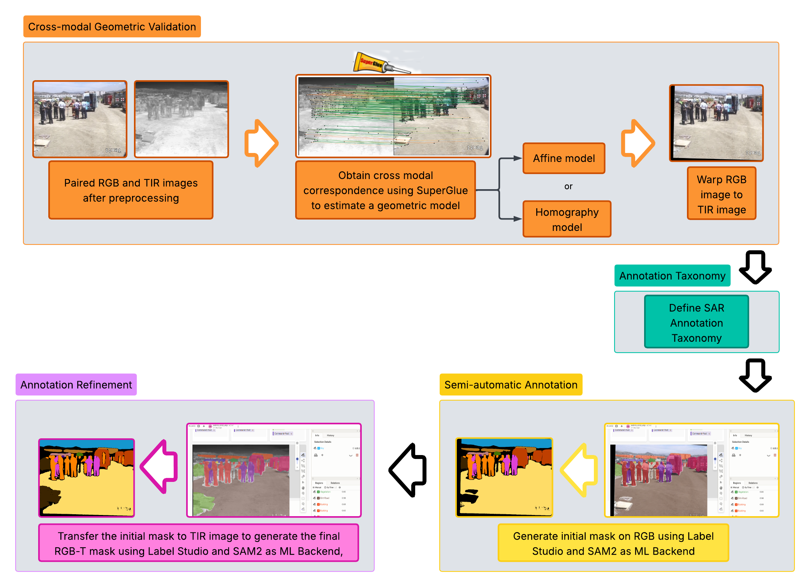

# RGB-T SAR Annotation and Registration Pipeline

This repository provides a complete pipeline for geometric registration,
semantic annotation, and annotation quality evaluation of RGB-Thermal
(RGB-T) image pairs in Search-and-Rescue (SAR) scenarios. The pipeline
integrates SuperGlue-based geometric alignment, SAM2-assisted annotation
in Label Studio, and inter-annotator agreement evaluation.

Repository: https://github.com/amsalase/CPGFANet/rgb_t_pipeline_sar

------------------------------------------------------------------------

# Pipeline Overview

The overall RGB-T pipeline is illustrated below:

The pipeline consists of three main stages:

1.  Cross-modal geometric registration (Homography or Affine)
2.  Semantic annotation using Label Studio with SAM2 backend
3.  Annotation quality evaluation using IoU and Dice metrics

------------------------------------------------------------------------

# Dataset Download

Download the RGB-T SAR dataset from the following link:

https://drive.google.com/drive/folders/10j-1mCuFDZQV2lD3SAVuPZy77RDe_flX?usp=sharing

After downloading, place the dataset in your local working directory
while preserving the folder structure.

------------------------------------------------------------------------

# Cross-Modal Geometric Registration

To compute geometric alignment between RGB and Thermal images, run the
notebook:

    hom_or_aff.ipynb

This notebook performs:

-   SuperGlue keypoint matching between RGB and Thermal images
-   Estimation of geometric transformation:
    -   Homography, or
    -   Affine transformation
-   Automatic model selection based on geometric consistency criteria

------------------------------------------------------------------------

## Required Camera Intrinsic Parameters

The following intrinsic calibration files must be provided:

    ost_rgb.txt
    ost_tir.txt

These files contain intrinsic camera parameters used to improve
geometric alignment accuracy.

------------------------------------------------------------------------

# Registration Results

The geometric alignment results are illustrated below:

Additional alignment outputs are available at:

https://drive.google.com/drive/folders/1Ed8-t1cDf42AYbpnVde72kftUv1XxP78?usp=sharing

------------------------------------------------------------------------

# Semantic Annotation using Label Studio and SAM2

The annotation workflow is illustrated below:

------------------------------------------------------------------------

## Label Studio and SAM2 Backend Configuration

To configure Label Studio and enable SAM2 as backend, follow the guides:

    Guía_Label_Studio_v2_0.pdf
    Guía_LabelStudio_wth_SAM2_backend.pdf

Once configured, annotation can be performed on RGB and Thermal images.

------------------------------------------------------------------------

# Converting Label Studio JSON Annotations to PNG Masks

After annotation, convert JSON outputs to segmentation masks using:

For polygon annotations:

    json_to_png_color_json-limpio-poligonos.ipynb

For SAM2 annotations:

    json_to_png_color_json-limpio.ipynb

------------------------------------------------------------------------

# Inter-Annotator Agreement (IAA) Evaluation

To evaluate annotation quality and consistency, run:

    iou_dice.ipynb

This notebook computes IoU and Dice agreement metrics.

------------------------------------------------------------------------

# Repository Structure

    rgb_t_pipeline_sar/
    │
    ├── hom_or_aff.ipynb
    ├── json_to_png_color_json-limpio.ipynb
    ├── json_to_png_color_json-limpio-poligonos.ipynb
    ├── iou_dice.ipynb
    │
    ├── ost_rgb.txt
    ├── ost_tir.txt
    │
    ├── Guía_Label_Studio_v2_0.pdf
    ├── Guía_LabelStudio_wth_SAM2_backend.pdf
    │
    ├── label studio and SAM2 pipeline-6.png
    ├── homography_images_III.png
    ├── Resume_method_III-1.png
    │
    └── README.md

------------------------------------------------------------------------

# Expected Outputs

The pipeline produces:

-   Registered RGB-T image pairs\
-   Segmentation masks (.png)\
-   Color semantic masks\
-   Annotation agreement metrics

------------------------------------------------------------------------

# Intended Use

This pipeline is designed for:

-   RGB-T semantic segmentation dataset creation\
-   Search-and-Rescue annotation workflows\
-   Multimodal dataset generation\
-   Annotation quality evaluation

------------------------------------------------------------------------

# Author

Andres Salas\
Universidad Técnica de Manabí\
Carrera de Ingeniería Electrónica y Automatización

------------------------------------------------------------------------

# License

This repository is intended for academic and research use.
